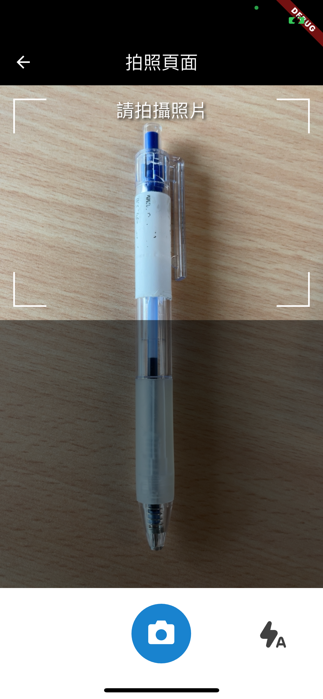
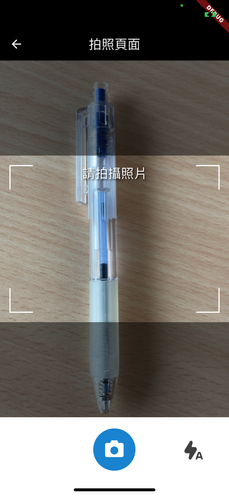
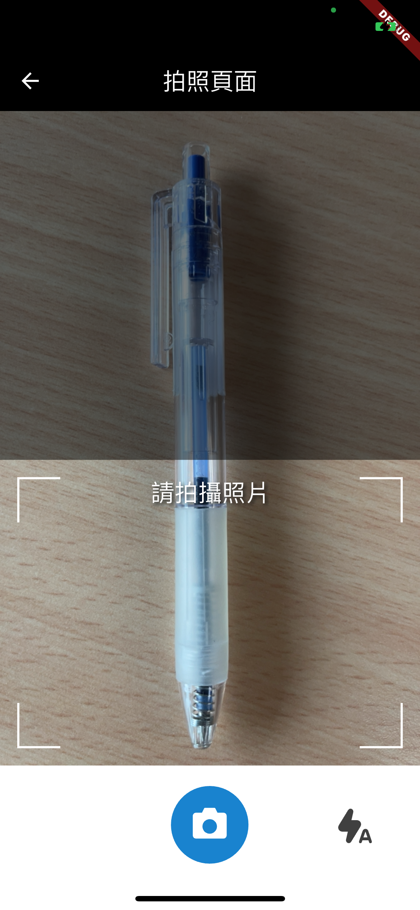
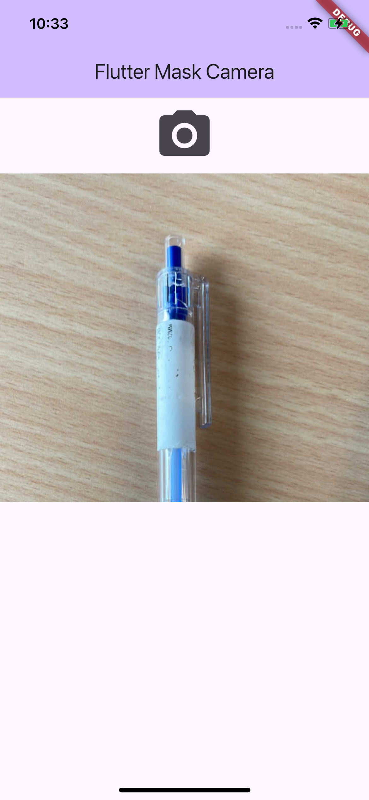
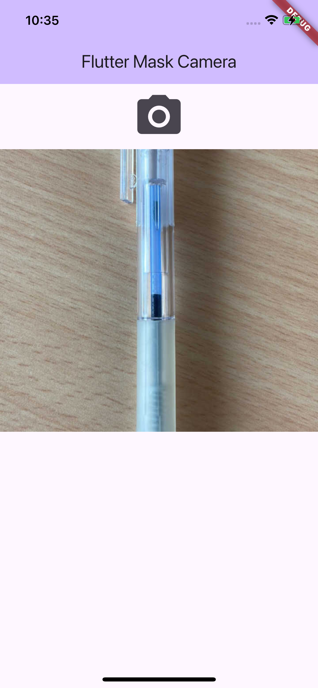
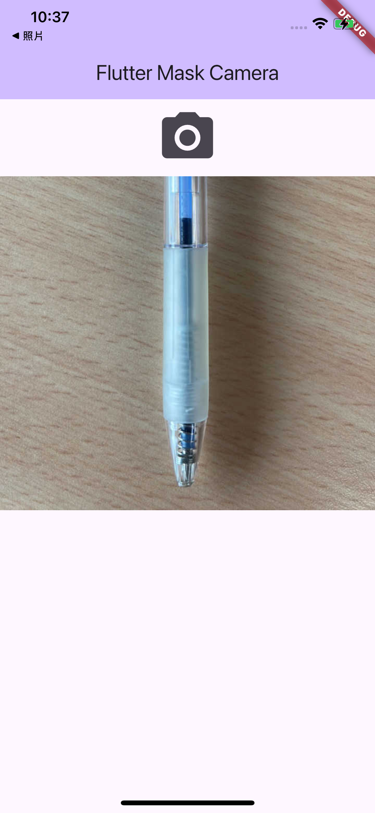

# flutter_mask_camera

A new Flutter project.

## Getting Started

This project is a camera with mask for a Flutter application.

## Sample
 ```Dart
  Future<void> _takePicture() async {
    final file = await showModalBottomSheet<File>(
      context: context,
      isScrollControlled: true,
      isDismissible: false,
      enableDrag: false,
      builder: (context) =>
          CameraDialog(title: AppLocalizations.of(context)!.cameraDialogTitle),
    );
    if (file != null) {
      setState(() {
        _imageFile = file;
      });
    }
  }
```

## More screenshots
| **Mask at Top** | **Mask at Center** | **Mask at Bottom** |
| ------------- | ------------- | ------------- |
||||
| **Top Cropped Image** | **Center Cropped Image** | **Bottom Cropped Image** |
||||